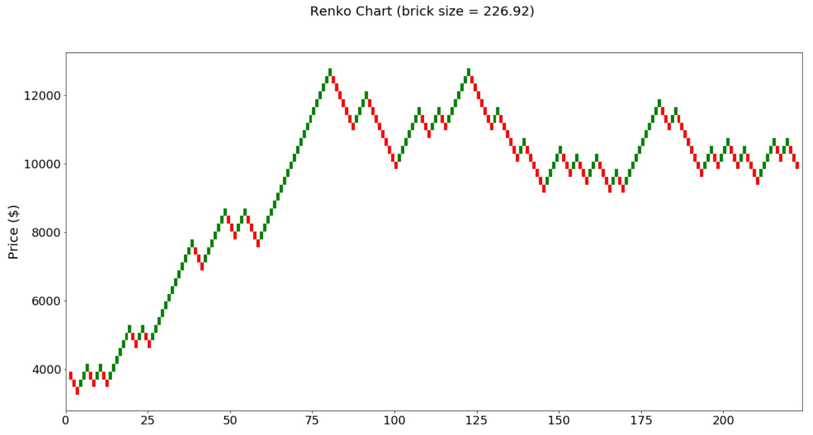

# TA-charts
### By: Carter Carlson

This repository provides technical tools to analyze OHLCV data, along with several TA chart functionalities.  These functions are optimized for speed and utilize numpy vectorization over built-in pandas methods.

Basic tools (`ta.py`):
* `rolling(src, n=2, fn=None, axis=1)`: rolling `sum`, `max`, `min`, or `mean` of `src` across `n` periods
* `sma(src, n=2)`: simple moving average of `src` across `n` periods
* `ema(src, n=2)`: exponential moving average for a list of `src` across `n` periods
* `atr(high, low, close, n=2)`: average true range from candlestick data
* `roc(src, n=2)`: rate of change of `src` across `n` periods

---

Momentum tools (`momentum.py`):
* `macd(src, slow=25, fast=13)`: moving average convergence/divergence of `src`
* `rsi(src, n=2)`: relative strength index of `src` across `n` periods
  * Used to measure the velocity and magnitude of directional price movement
* `tsi(src, slow=25, fast=13)`: true strength indicator of `src`
  * Used to determine overbought/oversold conditions, and warning of trend weakness through divergence

---
Technical indicators (`indicators.py`):
* `td_sequential(src, n=2)`: TD sequential of `src` across `n` periods
* `chaikin_money_flow(df, n=2)`: Chaikin Money Flow of an OHLCV dataset
* `murrey_math_oscillator(src, n=2)`: Murrey Math oscillator of `src`
---
Chart indicators:
* `bollinger.py`: Bollinger Bands
* `ichimoku.py`: Ichimoku Cloud
* `renko.py`: Renko Chart
---
Additional tools (located in `utils.py`):
* `group_candles(df, interval)`: combine candles so instead of needing a different dataset for each time interval, you can form time intervals using more precise data.
  * Example: you have 15-min candlestick data but want to test a strategy based on 1-hour candlestick data (`interval=4`).
* `fill_values(averages, interval, target_len)`: Fill missing values with evenly spaced samples.
  * Example: You're using 15-min candlestick data to find the 1-hour moving average and want a value at every 15-min mark, and not every 1-hour mark.
* `crossover(x1, x2)`: find all instances of intersections between two lines
* `intersection(a0, a1, b0, b1)`: find the intersection coordinates between vector A and vector B
* `area_between(line1, line2)`: find the area between line1 and line2


### How it works

```python
import pandas as pd
%matplotlib inline

# NOTE: File should contain the columns 'date', 'open', 'high', 'low', and 'close'
df = pd.read_csv('../Daily.csv')
```

#### Bollinger Bands
```python
from bollinger import Bollinger

b = Bollinger(df)
b.build(n=20)
b.plot()
```


#### Ichimoku
```python
from ichimoku import Ichimoku

i = Ichimoku(df)
i.build(20, 60, 120, 30)

i.plot()
```


#### Renko
```python
from renko import Renko

r = Renko(df)
r.set_brick_size(auto=True, atr_period=2)
r.build()

r.plot()
```

