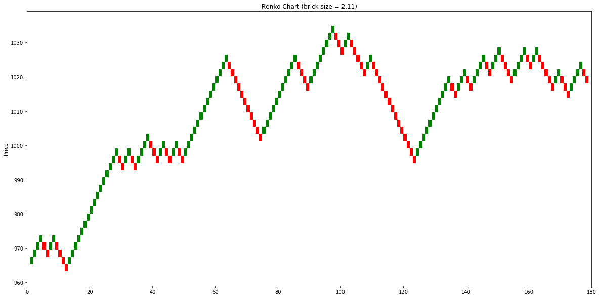

# TA-charts

This repository models price movement using several TA chart techniques:
* Ichimoku
* Bollinger Bands
* Renko

### How it works
#### Renko Chart
```python
from py.renko import Renko

# NOTE: File should be a CSV of candlestick data that contains columns 'High', 'Low', and 'Close' 
renko = Renko(<FILEPATH>)
renko.set_brick_size()
renko.build()

renko.plot()
```


